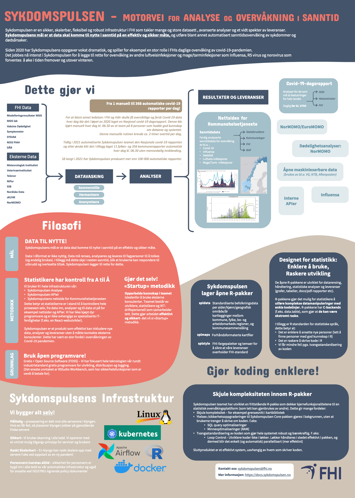

```{r setup, include=FALSE}
knitr::opts_chunk$set(echo = FALSE)
```

We are at the Kvalitetsregister Konferanse today and tomorrow!

Come and say hi :)

Poster presentations are tomorrow (16/11/21) from 10:45 to 11:30, and you can find us at _stand #23_. 

If you missed us, please see below a copy of the poster and handout

## Poster

```{r, layout="l-body", out.width = "100%"}

```

[conference_poster.pdf](./conference_poster.pdf)

## Handout

```{r, layout="l-body", out.width = "100%"}
knitr::include_graphics("conference_handout_1.jpg")
```

```{r, layout="l-body", out.width = "100%"}
knitr::include_graphics("conference_handout_2.jpg")
```

[conference_handout.pdf](./conference_handout.pdf)


