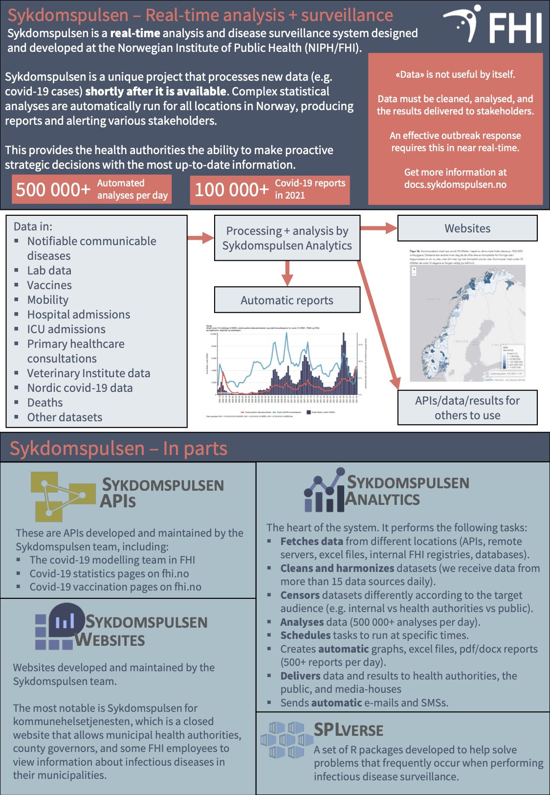

```{r setup, include=FALSE}
knitr::opts_chunk$set(echo = FALSE)
```

Det var totalt 47 postere på konferansen og Sykdomspulsen fikk prisen med omtale "Sykdomspulsen - En spennende og fremtidsrettet infrastruktur og nettside for overvåkning av covid-19, andre infeksjoner og dødelighet i sanntid".

- Denne prisen er utrolig viktig for oss som en liten påskjønnelse for alle de ekstra timene vi alle i Sykdomspulsen har jobbet gjennom pandemien. Vi setter veldig pris på den, sier seniorrådgiver Gry Marysol Grøneng ved Metodeutvikling og helseanalyse.

- Vi er de første i FHI som har et helautomatisk system som tar inn data, analyserer data og leverer rapporter, tabeller, kart, i tillegg til å levere data til GitHub og APIer for nettsider og modelleringsgruppen samt drifter en interaktiv nettside. Alt dette gjøres på en sikker, skalerbar og høyteknologisk infrastruktur uten en eneste manuell prosess. Vi er i tillegg kun seks årsverk som jobber med alt fra endring og inklusjon av nye datakilder, drift av infrastruktur og nettside, forbedring og brukersupport, forteller Gry.

```{r, layout="l-body", out.width = "100%"}
knitr::include_graphics("screenshot.png")
```

## Prisutdeling

<iframe width="560" height="315" src="https://www.youtube.com/embed/VeIcQU9Cj-4?start=4483" frameborder="0" allow="accelerometer; autoplay; clipboard-write; encrypted-media; gyroscope; picture-in-picture" allowfullscreen></iframe>

## Prisbelønnet poster

```{r, layout="l-body", out.width = "100%"}
knitr::include_graphics("poster.png")
```

[conference_poster.pdf](./conference_poster.pdf)

## Prisbelønnet handout

```{r, layout="l-body", out.width = "100%"}

```

```{r, layout="l-body", out.width = "100%"}
knitr::include_graphics("conference_handout_2.jpg")
```

[conference_handout.pdf](./conference_handout.pdf)

## Datakilder

I infrastrukturen tas det inn data fra mer enn 15 datakilder, de fleste oppdateres hver dag:

- MSIS
- MSIS labdatabasen
- SYSVAK
- NIPaR
- DÅR
- Vaksinedistribusjon
- Symptometer
- Modelleringsresultater
- KUHR (sKUHR)
- NorMOMO
- Veterinærinstituttet data
- SSB data
- Meteorologisk institutt data
- Nordiske Covid-19 data
- Telenor data
- Flere andre

## Analyser

Sykdomspulsen gjør over 500 000 analyser automatisk hver dag. Noen av disse analysene er tunge regresjonsanalyser, der det kjøres enkeltanalyser per aldersgruppe og per kommune. Det viktige med en del av disse analysene er å kunne lage resultater som sier noe om det er en økning av infeksjon i forhold til tidligere. Dette er viktig for å kunne gjøre tiltak i rett tid.

## Leveranser

Leveransene spenner over en stor skala fra enkle grafer til store rapporter. Den eneste grunnen til at dette lar seg gjøre er den svært fleksible infrastrukturen (se under 'Infrastruktur' for mer informasjon).

Sykdomspulsen leverer hver dag:

- Covid-19 dagsrapporter før frokost (mer enn 500 stk hver dag)
- Oppdatering av data til fhi.no
- Oppdatering av data til Sykdomspulsen for kommunehelsetjenesten nettsiden
- Oppdatering av data til modelleringsgruppa på FHI
- Oppdatering av GitHub data (maskinlesbare data som for eksempel NTB, VG og BT bruker)
- Tabeller med covid-19 vaksinasjoner til vaksinasjonsprogrammet
- Utregninger, tabeller, grafer og kart til faggruppen for influensa (brukes bla til influensa ukesrapport)
 
## Sykdomspulsen for kommunehelsetjenesten - nettsiden

Vi drifter en interaktiv nettside fra A til Å: Sykdomspulsen har bygget opp det tekniske, gjør automatisk oppdatering av data hver dag, har stått for webdesign, grafer, tekst og gjør all brukersupport. Denne nettsiden er kun for kommuneleger, statsforvaltere, smittevernleger, RHF og FHI og har per nå om lag 350 brukere, med ca 100 personer som er innom nettsiden på daglig basis.

## Infrastruktur

Sykdomspulsens infrastruktur er unik ved at den kan håndtere så store mengder data hver dag på en rask og effektiv måte. Infrastrukturen leser over 2 000 000 000 rader data og resultater (1TB) på daglig basis, og 1000 database-tabeller. Infrastrukturen er basert på R som gjør at den er veldig fleksibel og kubernetes gjør at den er veldig robust og kan skaleres. I tillegg er infrastrukturen veldig sikker da det er tilgangskontroll på hele infrastrukturen og kryptering i alle ledd.


