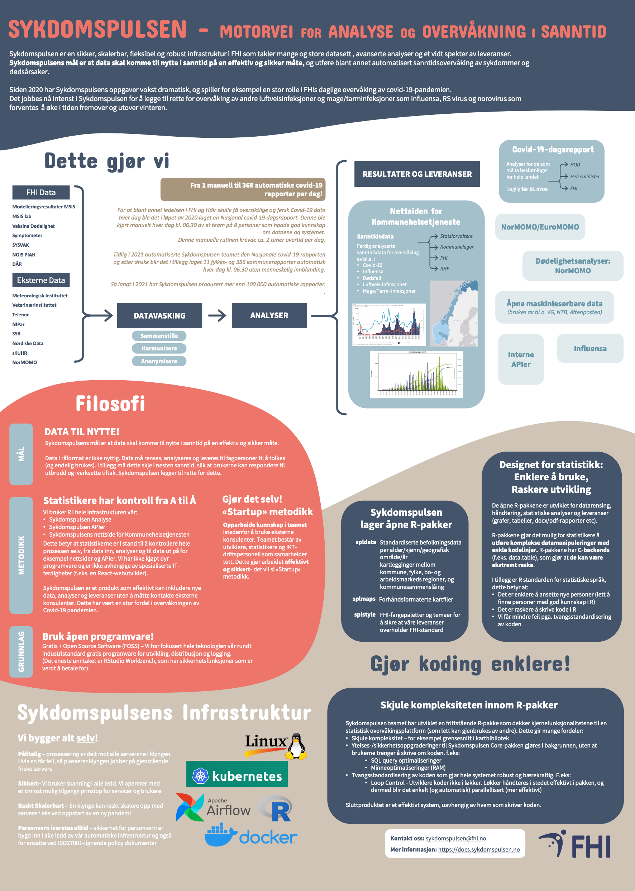
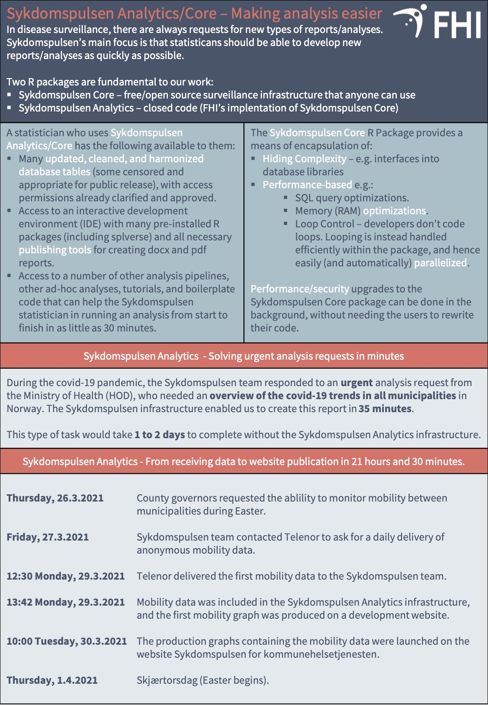

```{r setup, include=FALSE}
knitr::opts_chunk$set(echo = FALSE)
```

Of the 47 posters at the conference, it was Sykdomspulsen's poster "Sykdomspulsen - An exciting and forward-looking infrastructure and website for the real-time surveillance of Covid-19, other infections, and deaths" that received the prize for "Best Poster".

- This prize is important for us as a small acknowledgement for all the extra hours the Sykdomspulsen team have worked throughout the pandemic. We greatly appreciate this, says project leader Gry Marysol Grøneng.

- We are the first in FHI who have a totally automatic system that takes in data, analyses it, and delivers reports, tables, and maps, in addition to delivering data to GitHub and APIs for websites and the modelling group, while also running our own interactive website. All of this is done in a secure, scalable, and highly technical infrastructure without a single manual process. It is only six people who manage all of this, from the changes and inclusion of new data sources, maintainance of the infrastructure and website, improvements, and user support.

```{r, layout="l-body", out.width = "100%"}
knitr::include_graphics("screenshot.png")
```

## Awarding of the prize

<iframe width="560" height="315" src="https://www.youtube.com/embed/VeIcQU9Cj-4?start=4483" frameborder="0" allow="accelerometer; autoplay; clipboard-write; encrypted-media; gyroscope; picture-in-picture" allowfullscreen></iframe>

## Poster

```{r, layout="l-body", out.width = "100%"}

```

[conference_poster.pdf](./conference_poster.pdf)

## Handout

```{r, layout="l-body", out.width = "100%"}
knitr::include_graphics("conference_handout_1.jpg")
```

```{r, layout="l-body", out.width = "100%"}

```

[conference_handout.pdf](./conference_handout.pdf)

## Data sources

The infrastructure takes in data from more than 15 data sources. The most of which update on a daily basis:

- MSIS (notifiable disease registry)
- MSIS lab database
- SYSVAK (vaccination registry)
- NIPaR (Norwegian intensive and pandemic registry)
- DÅR (Norwegian cause of death Registry)
- Vaccine distribution
- Symptometer
- Modelling results
- KUHR (sKUHR) (control and disbursement of health payments)
- NorMOMO (Norwegian mortality monitoring)
- The Veterinary Institute
- SSB data
- The Meteorological Institute
- Nordic Covid-19 data
- Telenor data
- Others

## Analyses

Sykdomspulsen runs over 500 000 automatic analyses every day. Some of these analyses are heavy regression analyses, where a model is run multiple times over age groups and geographical locations. The important part is that these analyses give us the ability to identify increases in infection levels, which allows appropriate interventions to be enacted as quickly as possible.

## Deliverables

The deliverables span a large range from simple graphs to large reports. This is possible due to the etreme flexibility of our infrastructure (see the "Infrastructure" part for more information).

Every day Sykdomspulsen delivers:

- Covid-19 daily reports before breakfast (more than 500 every day)
- Updates of data to fhi.no
- Updates of data to the website "Sykdomspulsen for kommunehelsetjenesten" (Sykdomspulsen for the municipal health authorities)
- Updates of data to the modelling group in FHI
- Updates of the data on GitHub (machine-readable data that media houses such as NTB, VG and Aftenposten use)
- Tables with Covid-19 vaccination summary statistics for the vaccination program
- Calculations, tables, graphs, and maps to the influenza team
 
## Sykdomspulsen for the municipal health authorities - website

We also run an interactive website from A to Z. Sykdomspulsen has built up the technical infrastructure, ensured automatic daily updates, implemented the webdesign, graphs, text, and does all user support. This website is only for municipal health authorities, county governors, infectious disease doctors, regional health authorities, and FHI. It currently has approximately 350 registered users, of which approximately 100 use it daily.

## Infrastructure

Sykdomspulsen's infrastructure is unique because it can effectively manage large quantites of data on a daily basis in an extremely flexible manner. The infrastructure contains approximately 2 000 000 000 rows of data (~1TB) spread across 1000 database tables. The infrastructure is based on R, which makes it very flexible, and Kubernetes, which makes it very robust and easily scalable. In addition the infrastructure is tightly locked-down with access controls and encryption.
