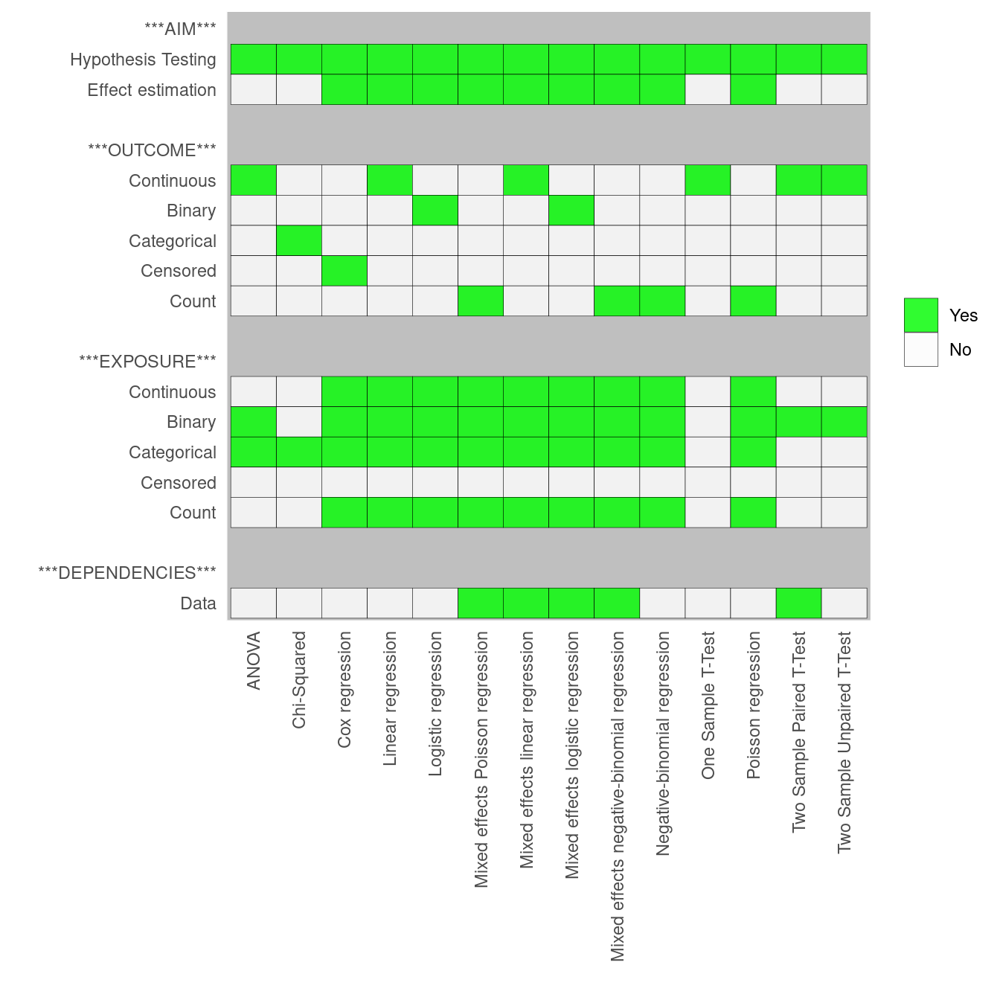

```{r setup, include=FALSE}
knitr::opts_chunk$set(echo = FALSE)
```

You can find the course "Which Stats Method" in the [Learning](./learning.html) tab.

This course will not teach students how to implement these statistical methods, as there is not sufficient time. The aim of this course is to enable the student to identify which methods are required for their study, allowing the student to identify their needs for subsequent methods courses, self-learning, or external help.

You should take this course if you are one of the following:

- Have experience with applying statistical methods, but are sometimes confused or uncertain as to whether or not you have selected the correct method.
- Do not have experience with applying statistical methods, and would like to get an overview over which methods are applicable for your projects so that you can then undertake further studies in these areas.


```{r, layout="l-body", out.width = "100%"}

```
