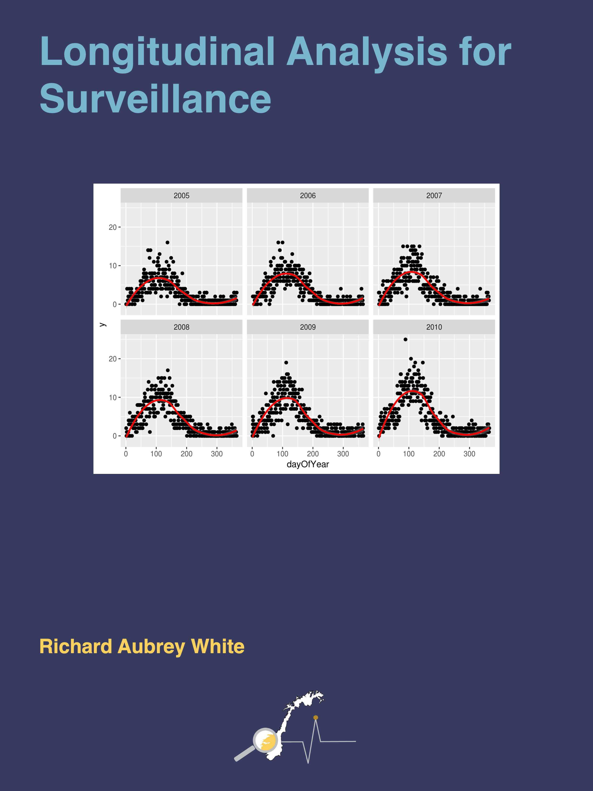

```{r setup, include=FALSE}
knitr::opts_chunk$set(echo = FALSE)
```

You can find the course "Longitudinal Analysis for Surveillance" in the [Learning page](/learning.html).

```{r, layout="l-body", out.width = "100%"}

```

When dealing with longitudinal data, there are two kinds of analyses that can be performed:

- "Time series" analyses generally deal with one variable. The aim is to then predict the future only using the previous observations. A common example would be to predict tomorrow’s temperature, using today’s and yesterday’s temperature as exposures. **We will not be focusing on these kinds of analyses in this course.**
- "Regression analyses" are very similar to ordinary regressions that you have been working with for many years. The only difference is that they have more advanced data structures that your current methods cannot handle. For example, if you want to see how the number of tuberculosis patients (outcome) is affected by the number of immigrants to Norway (exposure) over a 20 year period, then the number of patients in each year might be associated with each other, which might break assumptions of the regression models that you normally use (independent residuals). To account for the advanced structure of the data (correlation between different years) we will use more advanced regression techniques. **This will be the focus of the course.**
