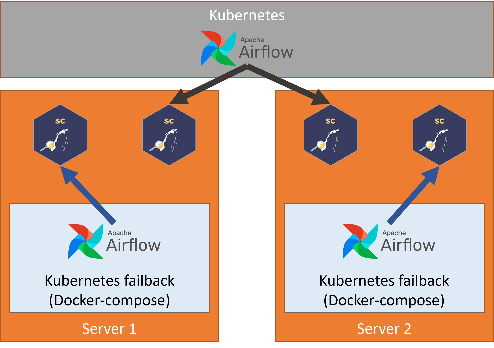

```{r setup, include=FALSE}
knitr::opts_chunk$set(echo = FALSE)
```

## What do we want?

Sykdomspulsen Analytic uses [Airflow](https://airflow.apache.org/) to schedule its tasks.

```{r, layout="l-body", out.width = "100%"}
knitr::include_graphics("airflow.png")
```

Airflow and Sykdomspulsen Analytics' tasks can be run on Kubernetes. This can be seen in the below graph, where one Airflow implementation dispatches tasks to both Server 1 and Server 2. However, with such a small team there is always the risk of something going wrong with a complicated Kubernetes setup. It is therefore preferable to have a failback solution that is independent of Kubernetes. We have achieved this by installing a duplicate Airflow system on each of the servers using Docker-compose. Each Docker-compose Airflow instance can dispatch tasks to its own server.

```{r, layout="l-body", out.width = "100%"}

```

However, this means that we have anywhere between 1 to 3 duplicate Airflow DAGs running at any time. All of these will be reading and writing to the same databases. This is obviously not desirable. **We must have only one Airflow instance operative at any time.**

## How do we get it?

It is not easy to seamlessly turn on and turn off multiple Airflow instances. We can, however, alter the operators inside each Airflow instance to be functional or non-functional.

It is for this reason that we developed a [custom Airflow Docker operator](https://airflow.apache.org/docs/apache-airflow/stable/howto/custom-operator.html). This custom Airflow Docker operator:

1. Checks an external YAML config file (`https://raw.githubusercontent.com/USERNAME/REPO/main/airflow-dag-on-server.yaml`) to see which server each DAG should be run on.
2. Checks to see if this server is the correct one.
3. If this is not the correct server, change the command to be excecuted to: `echo NOT CORRECT SERVER`.
4. Execute the command inside the Docker container. 

## Details

**https://raw.githubusercontent.com/USERNAME/REPO/main/airflow-dag-on-server.yaml**

```{.yaml}
---
dag_1: "server-1.tld"
```

**docker-compose.yml** (If using [Podman](https://podman.io/))

```{.yaml}
  volumes:
    - /var/run/podman/podman.sock:/var/run/docker.sock
  environment:
    HOST_HOSTNAME: $HOSTNAME
```

**/opt/airflow/plugins/operators/sc_operators.py** accesses the environmental variable `HOST_HOSTNAME` that is passed through from `docker-compose.yml`.

```{.yaml}
import os
import requests
import time
import yaml

from airflow.operators.docker_operator import DockerOperator

class SCDockerOperator(DockerOperator):
    def __init__(self, **kwargs) -> None:
        super().__init__(**kwargs)
        # self.name = name

    def execute(self, context):
        response = requests.get(
            "https://raw.githubusercontent.com/USERNAME/REPO/main/airflow-dag-on-server.yaml",
            headers = {"Cache-Control": "no-cache"}
        )
        unparsed_data = response.text
    
        data = yaml.safe_load(unparsed_data)
        
        print(data)
        print(self.dag.dag_id)
        
        if self.dag.dag_id not in data:
            self.command = '''bash -c "echo NOT CORRECT SERVER"'''
        elif data[self.dag.dag_id] != os.getenv("HOST_HOSTNAME"):
            self.command = '''bash -c "echo NOT CORRECT SERVER"'''
        else:
            print("OK")
        
        time.sleep(5)
        retval = super().execute(context)
        return retval
```

**/opt/airflow/dags/dag_1.py**

```{.yaml}
import random
from operators.sc_operators import SCDockerOperator

task = SCDockerOperator(
    task_id='my_task',
    image='localhost/splanalytics:latest',
    container_name= 'my_task_' + str(random.randint(10,100000)),
    api_version='auto',
    auto_remove=True,
    command=cmd,
    docker_url='unix://var/run/docker.sock',
    network_mode='bridge',
    privileged = True,
    dag=dag
)
```

## Conclusion

By editing `https://raw.githubusercontent.com/USERNAME/REPO/main/airflow-dag-on-server.yaml` we can quickly choose which server will execute the desired task. This is an easy way to manually control identical installations of Airflow as a failback system.
