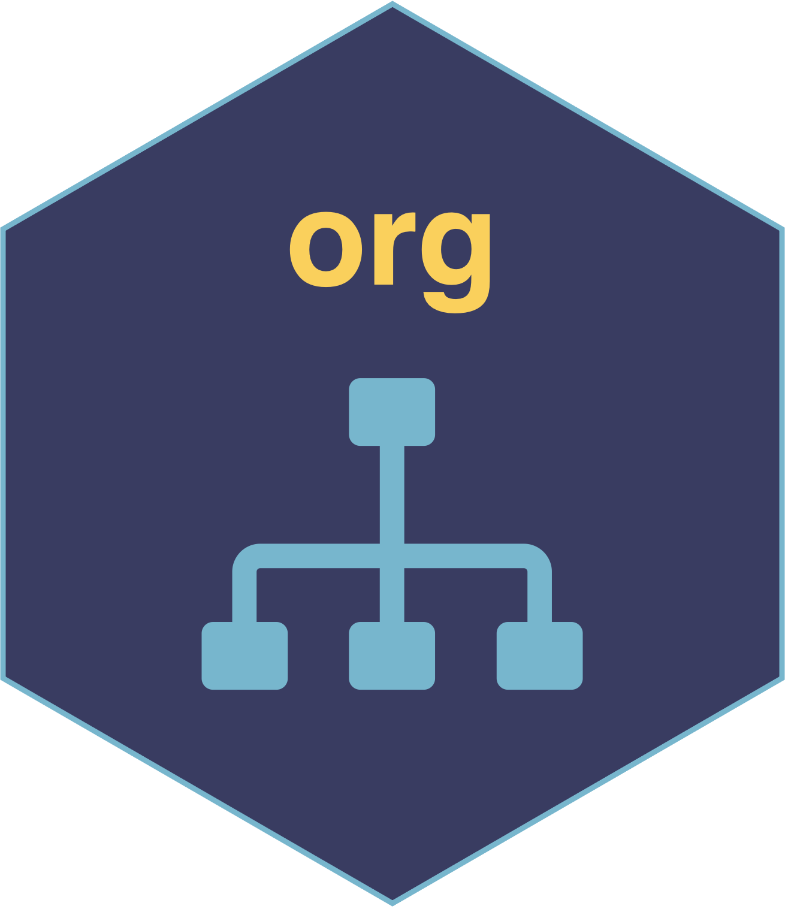

```{r setup, include=FALSE}
knitr::opts_chunk$set(echo = FALSE)
```

## Changes since last version

The R-package "org" (version 2022.7.20) has been published on [CRAN](https://cran.r-project.org/web/packages/org/index.html). "org" is a part of the [splverse](https://docs.sykdomspulsen.no/packages.html), a set of R packages developed to help solve problems that frequently occur when performing infectious disease surveillance.

A significant breaking change is that `org::initialize_project` now takes in `env` as an argument (the environment into which the functions will be sourced).

It is now recommended to include `env = .GlobalEnv` into the function call.

<aside>
```{r}

```
</aside>

```
org::initialize_project(
  env = .GlobalEnv,
  home = "/git/analyses/2019/analysis3/",
  results = "/dropbox/analyses_results/2019/analysis3/"
  raw = "/data/analyses/2019/analysis3/"
)
```

## Concept 

The concept behind `org` is fairly simple - most analyses have three main sections:

- code
- results
- data

Yet each of these sections have extremely different requirements.

Code should:

- Be version controlled
- Be publically accessible
- Have 1 analysis pipeline that logically and sequentially details all steps of the data cleaning, analysis, and result generation

Results should:

- Be immediately shared with close collaborators
- Have each set of results saved and accessible, so that you can see how your results have changed over time (i.e. "if we run the code today, do we get similar results to yesterday?")

Data should:

- Be encrypted (if sensitive)
- Not stored on the cloud (if sensitive)
