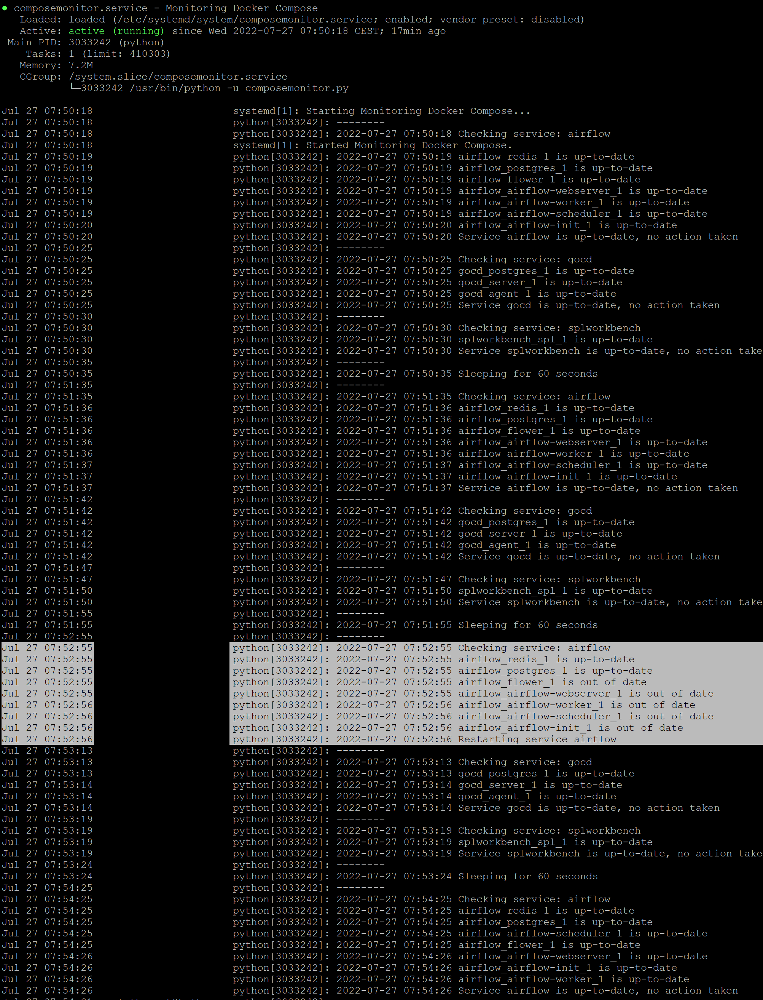

```{r setup, include=FALSE}
knitr::opts_chunk$set(echo = FALSE)
```

## What do we want?

Sykdomspulsen Analytics uses [Docker-Compose](https://docs.docker.com/compose/) with a [Podman](https://www.redhat.com/sysadmin/podman-docker-compose) backend.

We use [GoCD](https://gocd.org) as the CI/CD tool to build new images, however, deployment of these images is a difficult issue.

[Watchtower](https://containrrr.dev/watchtower/) is a process for automating Docker container base image updates, however, we encountered [issues](https://github.com/containrrr/watchtower/issues/1060) implementing it with a Podman backend.

With our particular setup, each Docker-Compose file is handled via systemd. We need a way to monitor if a new image has been pushed to `localhost`, which is not consistent with the images currently in use.

## Details

**/etc/systemd/system/airflow.service** is the systemd file that launches the Docker-Compose airflow file. We make sure that the service name is the same as the Docker-Compose folder (e.g. **airflow**.service and /home/XXXX/images/docker-compose/**airflow**).

```{.yml}
[Unit]
Description=Airflow with Docker Compose
Requires=podman.service
After=podman.service

[Service]
Type=oneshot
RemainAfterExit=true
WorkingDirectory=/home/XXXX/images/docker-compose/airflow
Environment="TMPDIR=/root/tmp"
ExecStartPre=/bin/sh -c "systemctl set-environment HOSTNAME=$(hostname)"
ExecStart=/usr/local/bin/docker-compose up -d
ExecStop=/usr/local/bin/docker-compose down

[Install]
WantedBy=multi-user.target

```

**/etc/systemd/system/composemonitor.service** is the systemd file that runs the python script `/home/XXXX/images/composemonitor/composemonitor.py`.

```{.yml}
[Unit]
Description=Monitoring Docker Compose
Requires=podman.service
After=podman.service

[Service]
Type=notify
RemainAfterExit=true
WorkingDirectory=/home/XXXX/images/composemonitor
Environment=PYTHONUNBUFFERED=1
ExecStart=/usr/bin/python -u composemonitor.py
Restart=on-failure

[Install]
WantedBy=multi-user.target
```

**/home/XXXX/images/composemonitor/composemonitor.py** which compares the images currently in use with the images in `sudo podman images`. If these are not consistent, then the service (e.g. airflow.service) is restarted.

It performs this check for the services: **airflow.service**, **gocd.service**, and **splworkbench.service**.

```{.yml}
if __name__ == '__main__':
    import subprocess
    import re
    import datetime
    import time
    import systemd.daemon
    
    systemd.daemon.notify('READY=1')
    
    service_names = ["airflow", "gocd", "splworkbench"]
    
    def check_service(service_name):
        print("--------")
        print(datetime.datetime.now().strftime("%Y-%m-%d %H:%M:%S"), "Checking service: " + service_name)
        
        containers = subprocess.run(["podman", "ps", "-a", "--format", "{{.Names}} {{.Image}} {{.ImageID}}"], stdout=subprocess.PIPE, stderr=subprocess.PIPE)
        containers = containers.stdout.decode('utf-8')
        containers = containers.split()
        
        number_containers = round(len(containers)/3)
        c_container_name = containers[0:len(containers):3]
        c_image_name = containers[1:len(containers):3]
        c_image_id = containers[2:len(containers):3]
        
        index = [i for i, item in enumerate(c_container_name) if re.search("^" + service_name + "_", item)]
        
        c_container_name = [c_container_name[i] for i in index]
        c_image_name = [c_image_name[i] for i in index]
        c_image_id = ['^'+c_image_id[i] for i in index]
        
        needs_update = False
        for i in range(len(c_image_id)):
            image = subprocess.run(["podman", "images", c_image_name[i], "--format", "{{.Id}}"], stdout=subprocess.PIPE, stderr=subprocess.PIPE)
            image_id = image.stdout.decode('utf-8')
            
            blah = re.search(c_image_id[i],image_id)
            if blah is None:
                print(datetime.datetime.now().strftime("%Y-%m-%d %H:%M:%S"), c_container_name[i] + " is out of date")
                needs_update = True
            else:
                print(datetime.datetime.now().strftime("%Y-%m-%d %H:%M:%S"), c_container_name[i] + " is up-to-date")
        
        if needs_update:
            print(datetime.datetime.now().strftime("%Y-%m-%d %H:%M:%S"), "Restarting service " + service_name)
            containers = subprocess.run(["systemctl", "restart", service_name+".service"])
        else:
            print(datetime.datetime.now().strftime("%Y-%m-%d %H:%M:%S"), "Service " + service_name + " is up-to-date, no action taken")
            
        time.sleep(5)
    
    while True:
        for service_name in service_names:
            check_service(service_name)
        
        print("--------")
        print(datetime.datetime.now().strftime("%Y-%m-%d %H:%M:%S"), "Sleeping for 60 seconds")
        
        time.sleep(60)
```

When running `sudo podman images` we see that the ID for `localhost/airflow:latest` is **75b3ca9b3ca2**.

```{r, layout="l-body", out.width = "100%"}

```

We then update the airflow image, with new ID **4942b104ded1**.

```{r, layout="l-body", out.width = "100%"}

```

We check `sudo systemctl status composemonitor.service` and see that it has detected that the airflow images are out-of-date. The service `airflow.service` is then rebooted, and the airflow images in use are updated.

```{r, layout="l-body", out.width = "100%"}

```

We see that `sudo podman ps -a` shows that the airflow containers have recently been restarted.

```{r, layout="l-body", out.width = "100%"}

```

## Conclusion

Through some simple python coding and systemd services, we have successfully created an automatic update mechanism for Docker-Compose with a Podman backend.
