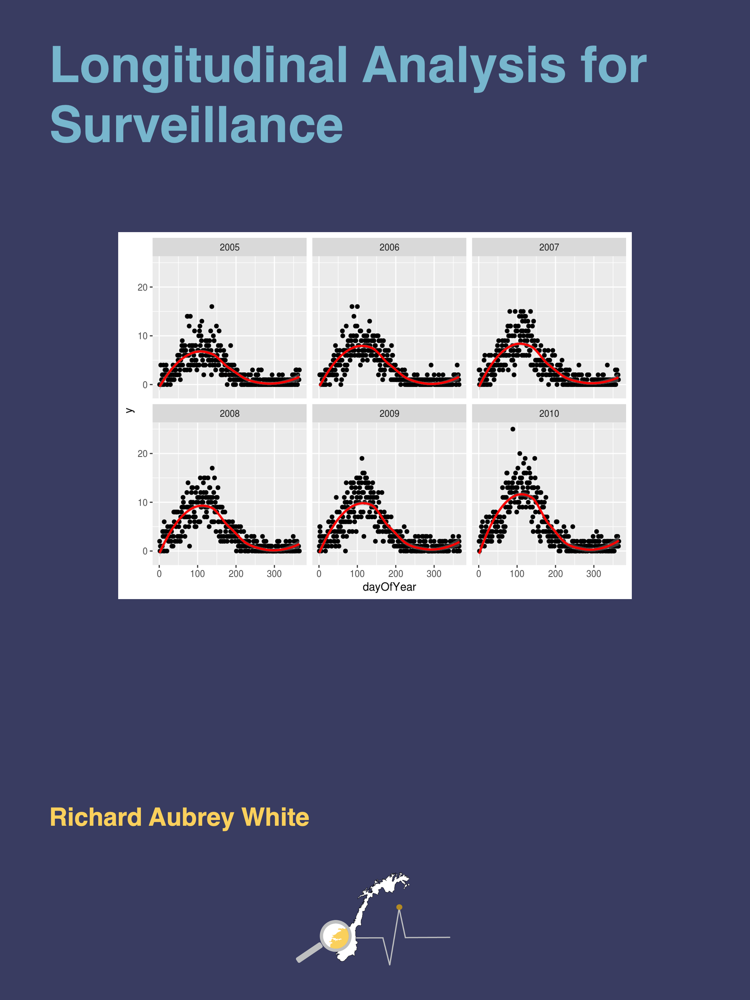

```{r setup, include=FALSE}
knitr::opts_chunk$set(echo = FALSE)
```


```{r, layout="l-body", out.width = "30%"}
knitr::include_graphics("learning/which-stats-method.png")
```

[Which Stats Method?](./which-stats-method/) provides a basic overview of general statistical methodology that can be useful in the areas of infectious diseases, environmental medicine, and labwork. By the end of this course, students will be able to identify appropriate statistical methods for a variety of circumstances.

This course will not teach students how to implement these statistical methods. The aim of this course is to enable the student to identify which methods are required for their study, allowing the student to identify their needs for subsequent methods courses, self-learning, or external help.

***

```{r, layout="l-body", out.width = "30%"}

```

[Longitudinal Analysis for Surveillance](./longitudinal-analysis-for-surveillance/) teaches students to run "normal regressions" in situations where the data structure would ordinarily prohibit you from running regression models. These situations mostly pertain to clusters of correlated data.

When dealing with longitudinal data, there are two kinds of analyses that can be performed:

- "Time series" analyses generally deal with one variable. The aim is to then predict the future only using the previous observations. A common example would be to predict tomorrow’s temperature, using today’s and yesterday’s temperature as exposures. **We will not be focusing on these kinds of analyses in this course.**
- "Regression analyses" are very similar to ordinary regressions that you have been working with for many years. The only difference is that they have more advanced data structures that your current methods cannot handle. For example, if you want to see how the number of tuberculosis patients (outcome) is affected by the number of immigrants to Norway (exposure) over a 20 year period, then the number of patients in each year might be associated with each other, which might break assumptions of the regression models that you normally use (independent residuals). To account for the advanced structure of the data (correlation between different years) we will use more advanced regression techniques. **This will be the focus of the course.**
