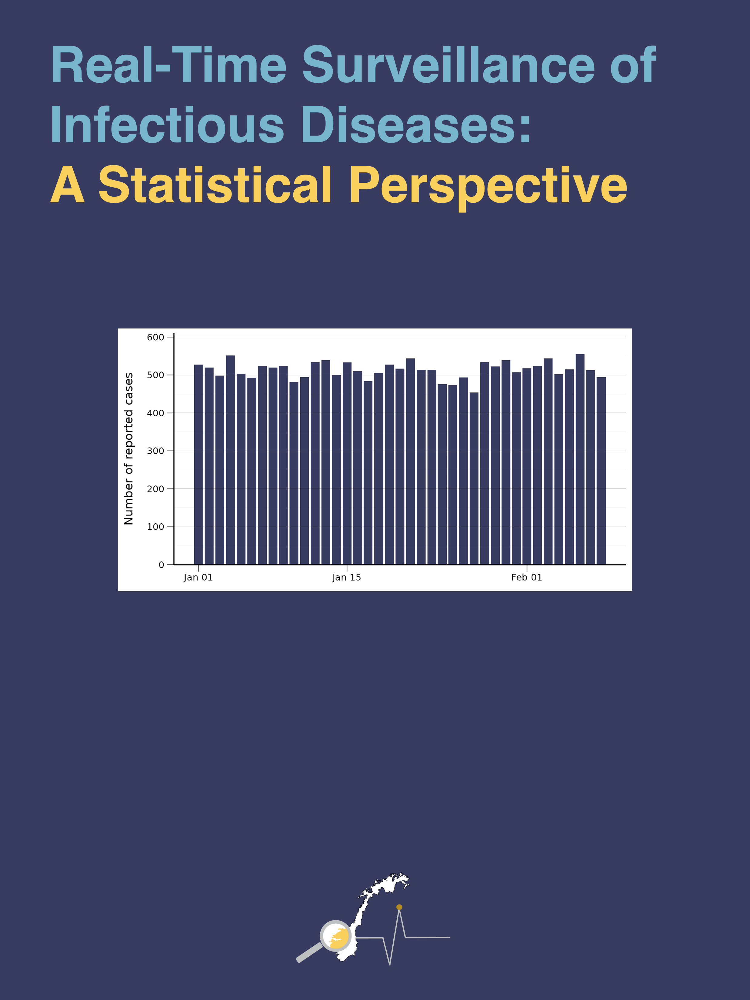

```{r setup, include=FALSE}
knitr::opts_chunk$set(echo = FALSE)
```

## Books

```{r, layout="l-body", out.width = "30%"}

```

[Real-Time Surveillance of Infectious Diseases: A Statistical Perspective](./surveillance-and-stats/) 

## Courses

```{r, layout="l-body", out.width = "20%"}

```

[Which Stats Method?](./which-stats-method/)

***

[Longitudinal Analysis for Surveillance](./longitudinal-analysis-for-surveillance/)
