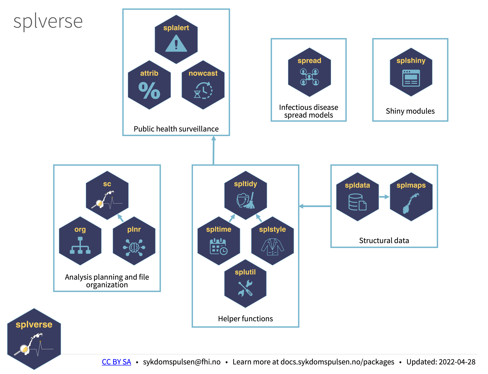

```{r setup, include=FALSE}
knitr::opts_chunk$set(echo = FALSE)
```

```{r, layout="l-body", out.width = "100%"}

```

## Installation and Use

```{r, layout="l-body", out.width = "20%", preview=TRUE}

```

If you want to install the dev versions (or access packages that haven't been released on CRAN), run `usethis::edit_r_profile()` to edit your `.Rprofile`. 

Then write in:

```
options(
  repos = structure(c(
    FHI  = "https://folkehelseinstituttet.github.io/drat/",
    CRAN = "https://cran.rstudio.com"
  ))
)
```

Save the file and restart R.

You can now install [splverse](https://docs.sykdomspulsen.no/packages) packages from the FHI registry.

## The splverse

```{r, layout="l-body", out.width = "20%"}
knitr::include_graphics("packages/nowcast.png")
```

[nowcast](./nowcast) helps you predict the present.

[Go to docs...](./org)

***

```{r, layout="l-body", out.width = "20%"}
knitr::include_graphics("packages/org.png")
```

[org](./org) is a system to help you organize projects.

[Go to docs...](./org)

***

```{r, layout="l-body", out.width = "20%"}

```

[plnr](./plnr) is a system to help you plan analyses.

[Go to docs...](./plnr)

***

```{r, layout="l-body", out.width = "20%"}
knitr::include_graphics("packages/spldata.png")
```

[spldata](./spldata) contains preformatted structural data for Norway.

[Go to docs...](./spldata)

***

```{r, layout="l-body", out.width = "20%"}
knitr::include_graphics("packages/splmaps.png")
```

[splmaps](./splmaps) contains preformatted maps of Norway that generally don't need geolibraries.

[Go to docs...](./splmaps)

***

```{r, layout="l-body", out.width = "20%"}
knitr::include_graphics("packages/splstyle.png")
```

[splstyle](./splstyle) contains helpful functions for creating outputs in the style(s) used by FHI and Sykdomspulsen.

[Go to docs...](./splstyle)

***

```{r, layout="l-body", out.width = "20%"}
knitr::include_graphics("packages/spltidy.png")
```

[spltidy](./spltidy) contains helpful functions for cleaning data.

[Go to docs...](./spltime)

***

```{r, layout="l-body", out.width = "20%"}

```

[spltime](./spltime) contains helpful functions for working with time.

[Go to docs...](./spltime)
